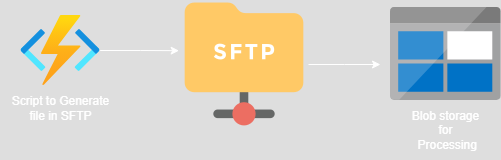
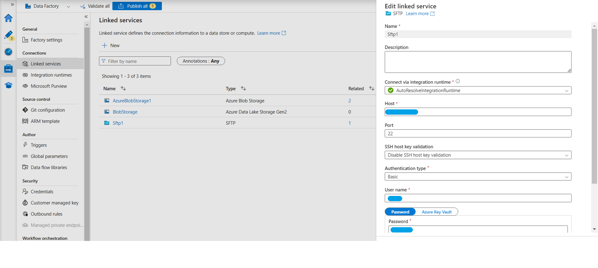
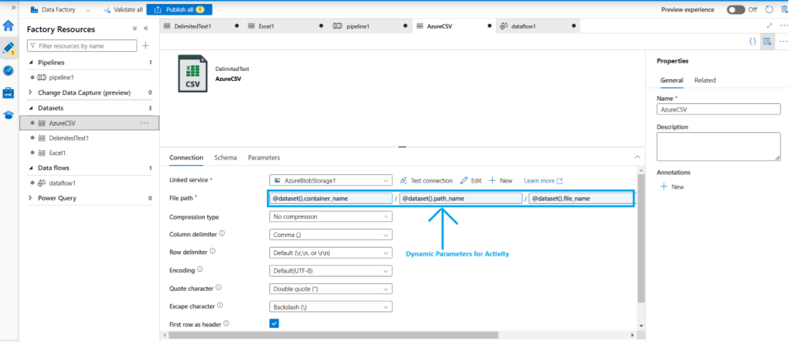
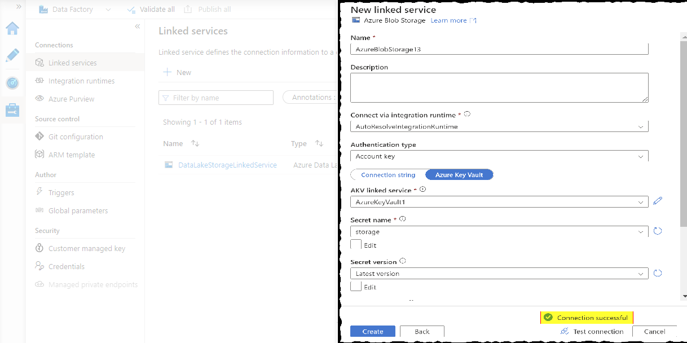
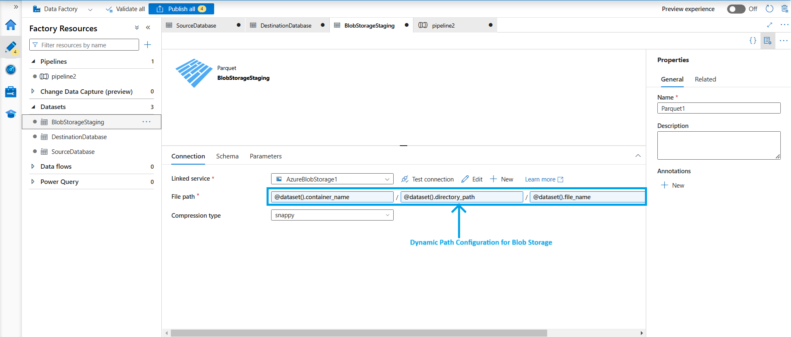
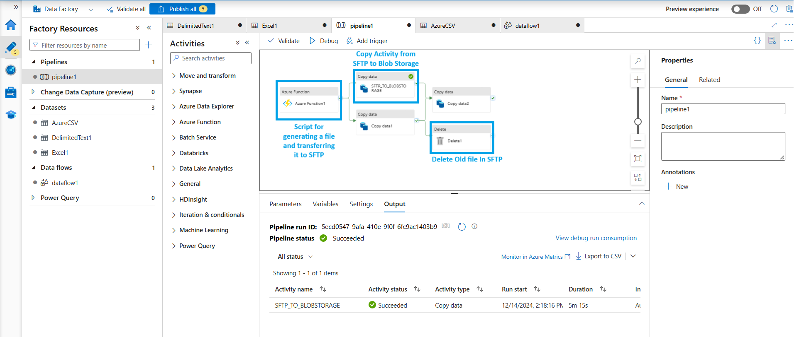

# 📄 Copy Activity Pipeline Documentation

## Overview

This document outlines the setup and process for automating the transfer of files from an **SFTP server** (where files are generated by an **Azure Function**) to **Azure Blob Storage** using **Azure Data Factory (ADF)**. After the copy process, the source files are deleted from the SFTP server to maintain storage hygiene.

---

## 🧩 Basic Cycle

### 1. Azure Function
- **Purpose**: Generates files and stores them on the SFTP server.
- **Trigger**: Timer-based or HTTP/event trigger.
- **Output Format**: CSV
- **Output Path**: `raw/outgoing-data/`

### 2. SFTP Server
- **Directory**: `raw/outgoing-data/`
- **Access**: Secured via SSH with credentials managed in **Azure Key Vault**
- **Lifecycle**: Files are removed after being successfully copied to Azure Blob Storage

### 3. Azure Blob Storage
- **Container**: `raw-data`
- **Access**: Secured via **Managed Identity** or **Key Vault**
- **Output Format**: parquet
- **Usage**: Acts as the raw layer in the data lake for downstream processing

---

## 🔗 Linked Services Configuration

### 🔹 SFTP Linked Service
- **Type**: SFTP
- **Authentication**: Username & SSH key stored in Azure Key Vault
- **Host**: `sftp.partnerdomain.com`
- **Port**: `22`

### 🔹 SFTP Datasets
- **Type**: SFTP
- **Path**: Configured the dynamic path for copy activity for Source Path 

### 🔹 Azure Blob Storage Linked Service
- **Type**: Azure Blob Storage
- **Authentication**: Managed Identity or Key Vault
- **Container**: `raw-data`

### 🔹 Azure Blob Storage Linked Service
- **Type**: Azure Blob Storage
- **Path**: Configured the dynamic path for copy activity for destination path

---

## 🔄 Pipeline: `CopySFTPToBlobAndCleanup`

### 🔸 Activities

1. #### Azure Function Script to Dump In SFTP
   - **Type**: `Lookup`
   - **Description**: Retrieves list of files in `raw/outgoing-data/` directory on SFTP
   - **Output**: Array of file paths

2. #### Azure Copy Activity
   - **Copy Data**
     - **Source**: SFTP `raw/outgoing-data/{filename}`
     - **Sink**: Azure Blob Storage `piluspi-container/raw-data/{filename}`
     - **Retry Policy**: 3 attempts

3. #### Delete Activity for old Dump in SFTP
   - **Delete File (Post Copy)**
     - **Type**: `Delete`
     - **Condition**: Executed only if the copy succeeds
     - **Target**: SFTP `raw/outgoing-data/{filename}`
